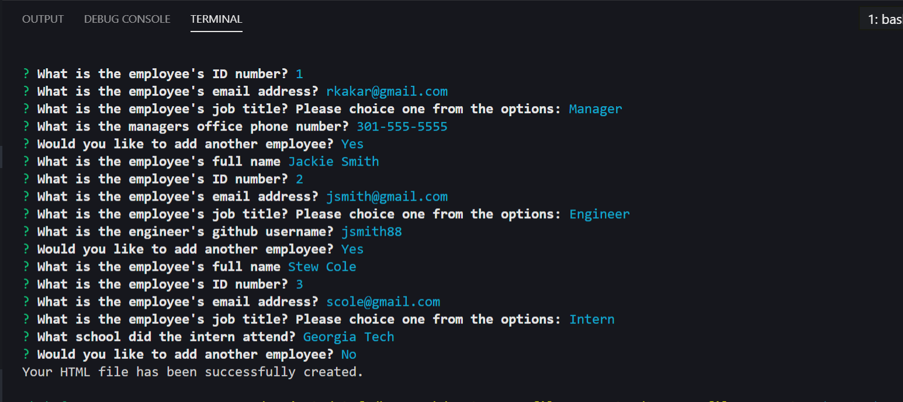
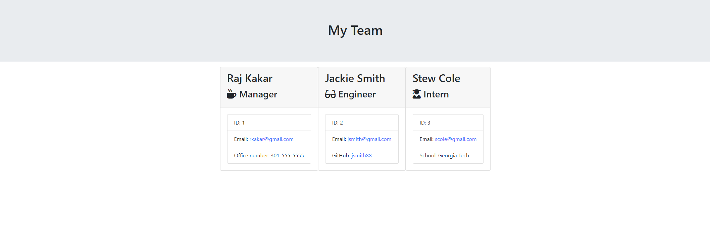

# team-profile-generator

## Purpose

For this project, I successfully created a CLI node application that allows managers to generate a webpage that displays his or hers team's basic info so that they have access to emails and github profiles.

Github Repo: <https://github.com/rajdeep24/team-profile-generator>

## technologies used

To successfully develop this app, I used the following technologies:

- Node CLI
- NPM inquirer
- NODE fs
- TDD with Jest
- JavaScript
- HTML
- CSS

## Application Demo

### Video Demonstration

Video Link: <https://drive.google.com/file/d/1LOuhgRwo-91wxqWgTOyfOqvmMjtpGFpk/view>

### Node CLI Screen Shot

### team.html (output)

## Badges

